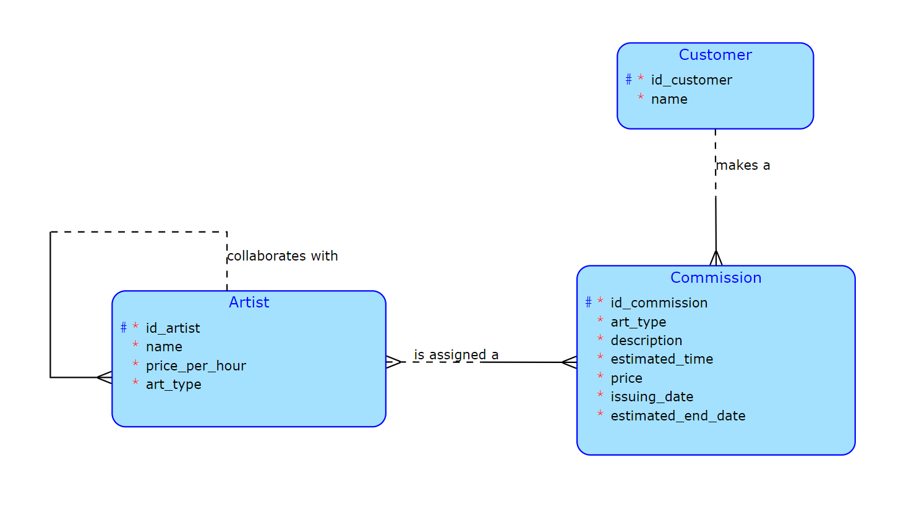
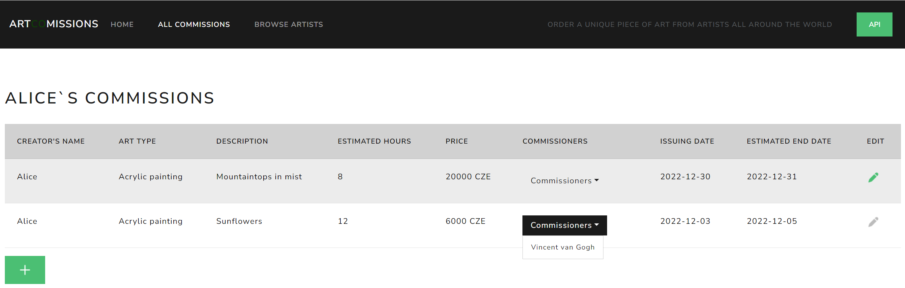
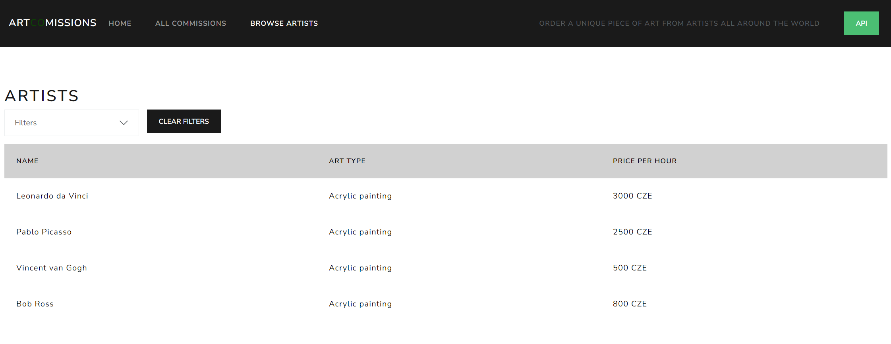

# BI-TJV Semestral Work

An application that allows the user to order art from artists (such as painters, musicians, writers, dancers, sculpturers etc.)

## About
This is a school project that I was developing as part of the BI-TJV course (short for Technology Java). It is a small application
with backend written in Java, using the Spring framework, Hibernate and REST API for communication with the frontend, which was
written using Java and Thymeleaf. The application is built with Gradle and Docker.

The main goals of this project was to learn how to develop an application with layered architecture, the basics of Spring Framework,
writing REST API and using it, using an SQL database in an app and working with Docker.

For more information about the API, see the api-documentation.yml.

## Prerequisites
You need to have Docker installed.

## How to run the application
From the root directory run:
``` ./run.sh ```

The script should build the application and the needed images and start them on Docker.
The app runs locally on a local PostgreSQL database.

You will find the application on this address: http://localhost:8081/


## Conceptual Data Model



## Example images of the website


