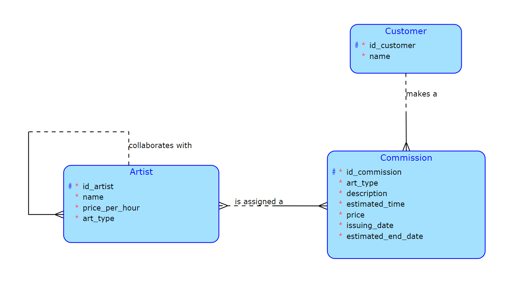

# BI-TJV Semestral Work

An application that allows the user to order art from artists (such as painters, musicians, writers, dancers, sculpturers etc.)

## How to run the application
From the root directory run:
``` ./run.sh ```

The script should build the needed images and start them on Docker.

You will find the application on this address: http://localhost:8081/

### **Business operations:**
- Create an art commission (depending on the wanted art type, the customer can only hire artists specialized on it)
- View user's commissions or available artists - ability to sort and filter the data (by price, artist's name, art type or by number of active commisions)
- Update an art commission - change the description, estimated duration or add a collaborating artist

- **Complex Business Operation:** Hire a group of artists
    - Some artists can collaborate with other artists. These artists can be hired solo, or together with some of the artists, that they work with (the customer doesn't have to hire the whole group, it can be just a part of it, but they cannot hire a group of artists, that do not collaborate together).
    - Ex.: We have two artists Bob and Alice who collaborate and an artist John, who doesn't work together with anyone. The customer can either hire Bob, Alice or John separately, or Alice and Bob together, but not Alice and John together.
    - The more artists hired, the pricier the commission

**Complex query:** When the customer browses the available artists, they can sort by the number of commissions the artists currently have (calculated using the estimated end date and the current date). The query returns how many commissions each artist currently has ascendingly.

### **Conceptual Data Model:** 


##### *Side note: Expect each artist works eight hours a day*